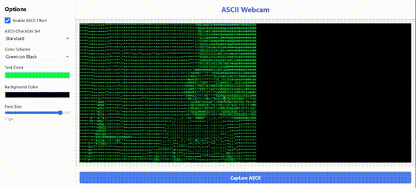

# ASCII-WEBCAM

This is a simple python script that captures the webcam feed and displays it on a canvas using ASCII characters.

## demo

#### [https://kaminskypavel.github.io/ascii-webcam/](https://kaminskypavel.github.io/ascii-webcam/)

